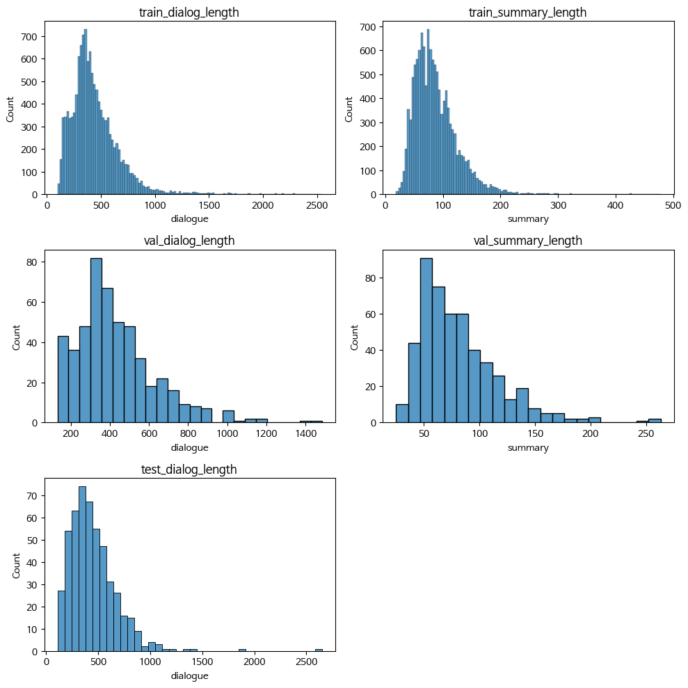
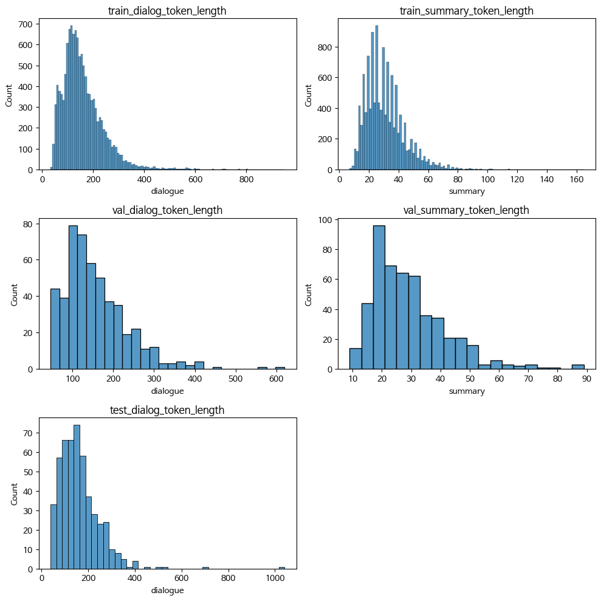

# EDA
- 주어진 데이터의 length 및 tokenization한 데이터의 length 시각화
    - hyper-parameter tuning 시 해당 EDA 결과를 반영하여 max_length 값에 대한 변화를 주었으나 성능 좋아지지 않음.
    - 리서치 시, fine-tuning된 한국어 모델은 대부분이 max_length 가 '512'로 최적화 된 것을 알게 되어 이후 다른 모델에 fix.
## length

## token length

# 데이터 전처리
1. 개인정보 마스킹 special token 적용
2. 주어진 train data에 자/모음으로만 구성된 문자열이 있어 정규식을 활용하여 처리
3. 그외에도 추가적인 전처리가 필요한 데이터를 팀원분이 알려줘서 처리

# Llama3 (kobart 외 사용한 모델)
- Meta(구 Facebook)가 개발한 8 및 70B 크기의 사전 학습 및 인스트럭션 튜닝된 대형 언어 모델(LLM)로, 자연어 처리(NLP) 작업을 위한 강력한 인공지능 도구이며 이전 버전인 Llama2의 성공을 바탕으로 더욱 발전된 성능과 효율성을 제공

## [beomi/Llama-3-Open-Ko-8B](https://huggingface.co/beomi/Llama-3-Open-Ko-8B)
- Meta의 Llama-3-8B를 기반으로 사전 학습된 언어 모델
- 이 모델은 60GB 이상의 중복 제거된 텍스트가 포함된 공개적으로 사용 가능한 리소스로 완전히 학습
- 새로운 Llama3 토큰나이저는 한국형 토큰나이저(Llama2-Ko 토큰나이저)보다 약간 많은 177억 개 이상의 토큰으로 사전 학습이 진행됨

## 시도한 부분
- 사용중인 GPU의 CUDA 연산 능력을 확인해 8이상이면 고성능 GPU 로 판단하여 Attention 메커니즘 선택하고 torch 데이터 타입을 bfloat16으로 설정하여 메모리 사용량을 줄이면서도 계산의 정확성을 유지할 수 있게 함 
- 대규모 사전 학습된 모델을 보다 효율적으로 미세 조정하기 위한 방법인 PEFT(파라미터 효율적 미세 조정, Parameter-Efficient Fine-Tuning) 중 하나인 LoRA(Low-Rank Adaptation)를 사용하여 언어 모델을 효율적으로 미세 조정하기 위해 설정
    - 모델의 전체 파라미터를 업데이트하는 대신, 일부 소량의 파라미터만을 조정하여 학습을 진행할 수 있게 하여 컴퓨팅 자원과 메모리 사용량을 크게 줄일 수 있음
- QLoRA(Quantized Low-Rank Adaptation)는 LoRA에 양자화(Quantization) 기법을 추가해 LoRA보다 더 적은 메모리와 자원을 사용하면서도 비슷한 성능을 낼 수 있는 방법으로 4비트 양자화 설정
- SFTTrainer(Supervised Fine-Tuning Trainer)를 사용하여 사전 학습된 언어 모델을 해당 task에 맞게 지도 학습(Supervised Fine-Tuning)으로 대규모 언어 모델의 미세 조정 과정을 쉽게 관리하고 실행할 수 있도록 함

LoRA란?
LoRA는 대규모 언어 모델을 미세 조정할 때 모델 전체의 가중치를 변경하는 대신, 작은 크기의 어댑터 행렬을 추가 하여 학습하는 방법이다. 이를 통해 학습해야 할 파라미터수를 줄여 학습 속도를 높이고 메모리 사용량을 줄일 수 있다. 이렇게 하면 메모리 요구량과 계산 비용을 크게 절감할 수 있다.

# 아쉬웠던 점
- baseline에서 사용한 모델 외 타 kobart 모델도 사용해보고 num_beams 를 조정해보거나 length_penalty 및 repetition_penalty 값을 추가해도 kobart 모델로는 최고의 성능을 낼 수 없어서 좀 아쉬웠음
- Llama3 모델 사용 시 'CUDA OutOfMemory'가 자주 발생해서 좀 답답한 느낌 들었음
- 1 epoch에 출력한 output에서 speical token들이 빠져있었는데 tokenizer의 vocab, model의 resize_token_embeddings, special token 관련 default paramerter로 설정되는 부분을 모두 확인했으나 왜 빠져있는지는 아직도 의문 

# 시도해보고싶은 점
- 학습 데이터 셋에 주어진 'topic'을 사용하지 않았는데 bert 모델을 활용해 topic 분류 후 각 topic 마다의 vocabulary를 활용하여 대화를 요약해보는 것
